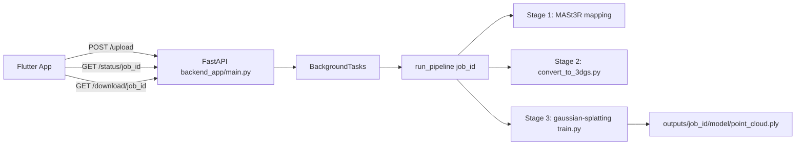

# VokVision - Knowledge Transfer Document

Branch scope: SAM_implementation

This document is the handover guide for engineers onboarding to the current reconstruction stack in this branch. It covers implementation status, architecture, runtime behavior, and technical debt from a production engineering perspective.

## 1) Executive Summary

VokVision is a mobile-to-backend 3D reconstruction platform that:

1. Captures multi-view images from Flutter clients.
2. Accepts uploads through FastAPI.
3. Runs a 3-stage reconstruction pipeline:
    - MASt3R pose and sparse reconstruction.
    - Dataset conversion to Gaussian Splatting format.
    - Gaussian Splatting training and export.
4. Exposes status polling and model download endpoints.

Current branch status:

1. Core upload/pipeline/download flow is implemented and runnable.
2. SAM integration is not active in this branch despite the branch name.
3. The branch currently tracks baseline pipeline behavior close to main.

## 2) High-Level Architecture



Primary implementation entry points:

1. API server: backend_app/main.py
2. Pipeline orchestration: backend_app/pipeline.py
3. Runtime config: backend_app/config.py
4. MASt3R core mapping script: mast3r/kapture_mast3r_mapping.py
5. 3DGS training entry: gaussian-splatting/train.py
6. Mobile app entry: lib/main.dart

## 3) Repository Map (Relevant to Production Path)

```text
VokVision/
|- backend_app/
|  |- main.py
|  |- pipeline.py
|  |- config.py
|  |- reconstruction/
|  |- uploads/
|- mast3r/
|  |- kapture_mast3r_mapping.py
|  |- model.py
|  |- run_mast3r_reconstruction.py
|  |- README.md
|  |- checkpoints/ (expected local folder)
|- gaussian-splatting/
|  |- train.py
|  |- convert.py
|  |- scene/
|  |- gaussian_renderer/
|- lib/ (Flutter app)
|- pubspec.yaml
```

Notes:

1. backend_app/pipeline.py references convert_to_3dgs.py, but this file is not present in the repository root or backend_app.
2. gaussian-splatting/convert.py exists, but its CLI contract differs from what pipeline.py calls.

## 4) Backend API Implementation

File: backend_app/main.py

Endpoints:

1. GET /
    - Returns health message.

2. POST /upload/
    - Inputs: multipart list of image files.
    - Behavior:
      - Generates UUID job_id.
      - Saves files under backend_app/uploads/{job_id}.
      - Enqueues background run_pipeline(job_id).
    - Returns:
      - job_id
      - status="processing"

3. GET /status/{job_id}
    - Checks if backend_app/outputs/{job_id}/model exists.
    - Returns done or processing.

4. GET /download/{job_id}
    - Returns backend_app/outputs/{job_id}/model/point_cloud.ply if available.
    - Returns 404 when file is absent.

Operational implications:

1. Status state is file-system-derived, not persisted in a DB.
2. Failures in background task are not explicitly surfaced via status API.
3. Endpoint security and per-user authorization are not implemented.

## 5) Pipeline Orchestration Implementation

File: backend_app/pipeline.py

Pipeline stages:

1. Stage 1 - MASt3R Pose Estimation
    - Command:
      - python ../mast3r/kapture_mast3r_mapping.py --input_dir uploads/{job_id} --output_dir outputs/{job_id}/mast3r --mode sfm

2. Stage 2 - Conversion to 3DGS Dataset
    - Command currently coded:
      - python convert_to_3dgs.py --input outputs/{job_id}/mast3r --output outputs/{job_id}/dataset
    - Current branch risk:
      - convert_to_3dgs.py missing.

3. Stage 3 - Gaussian Splatting Training
    - Command:
      - python ../gaussian-splatting/train.py -s outputs/{job_id}/dataset --model_path outputs/{job_id}/model --iterations 5000

Execution model:

1. subprocess.run per stage.
2. Non-zero return exits process via sys.exit(1).
3. Output existence checks at stage boundaries.

Important implementation caveats:

1. run_command exits process on stage failure, which can be harsh for worker lifecycle in managed runtimes.
2. No retry/backoff behavior.
3. No partial checkpoint/restart behavior across stages.

## 6) Runtime Configuration

File: backend_app/config.py

Configured constants:

1. MAST3R_PATH = ../mast3r
2. GAUSSIAN_PATH = ../gaussian-splatting
3. UPLOAD_DIR, OUTPUT_DIR, TEMP_DIR rooted in backend_app
4. DEVICE = cuda
5. IMAGE_SIZE = (1024, 768)
6. ITERATIONS = 7000

Observations:

1. pipeline.py currently hardcodes --iterations 5000 instead of using ITERATIONS.
2. config.py values are not environment-overridable in current implementation.

## 7) MASt3R Integration Details

Relevant files:

1. mast3r/kapture_mast3r_mapping.py
2. mast3r/model.py
3. mast3r/run_mast3r_reconstruction.py
4. mast3r/CHECKPOINTS_NOTICE

Expected checkpoint requirement:

1. MASt3R_ViTLarge_BaseDecoder_512_catmlpdpt_metric.pth is required locally.
2. Checkpoint is intentionally not versioned in repo due to size constraints.

Behavioral summary:

1. Mapping script processes image sets and outputs reconstruction artifacts for downstream conversion/training.
2. Depends on CUDA-capable PyTorch runtime for practical performance.

## 8) Gaussian Splatting Integration Details

Relevant files:

1. gaussian-splatting/train.py
2. gaussian-splatting/scene/*
3. gaussian-splatting/convert.py

Behavioral summary:

1. Uses COLMAP-style reconstruction and image set to train Gaussian representations.
2. Produces model artifacts and point cloud output under model_path.
3. Tooling includes SIBR viewers and CUDA submodules; many TODOs inside vendored/external code are inherited upstream and are not immediate product blockers.

## 9) SAM_implementation Branch Reality Check

Despite branch naming, this branch currently does not contain active SAM pipeline integration in backend_app.

What exists now:

1. End-to-end 3D reconstruction orchestration baseline.
2. No segmentation stage in backend_app/pipeline.py.
3. No backend_app segmentation module currently wired.

Engineering implication:

1. If product messaging assumes SAM-enabled masking in this branch, it is out of sync with code.
2. KT for SAM should reference a branch that contains segmentation implementation (for example, v2).

## 10) Technical Debt Register

Severity legend:

1. Critical: breaks core workflow or causes silent failure.
2. High: production reliability/security impact.
3. Medium: maintainability/operability gap.
4. Low: quality improvements.

Critical debt:

1. Missing conversion script in active pipeline path.
    - Evidence: backend_app/pipeline.py calls convert_to_3dgs.py, file not found.
    - Impact: Stage 2 fails at runtime.
    - Recommendation:
      - Either add convert_to_3dgs.py with the expected --input/--output contract.
      - Or update pipeline.py to call existing gaussian-splatting/convert.py with compatible args.

2. Status API cannot represent failure states.
    - Evidence: backend_app/main.py returns only done/processing based on directory existence.
    - Impact: clients can poll forever after failed jobs.
    - Recommendation:
      - Persist job state in DB/table: queued/running/failed/succeeded.
      - Store stage and error payload.

High debt:

1. Background task execution model is not horizontally scalable.
    - Evidence: FastAPI BackgroundTasks used directly.
    - Impact: weak durability and poor control under load.
    - Recommendation: move to Celery/RQ/Arq + Redis queue.

2. AuthN/AuthZ is absent for model download.
    - Evidence: open GET /download/{job_id} path.
    - Impact: unauthorized model access risk.
    - Recommendation: enforce user-bound job ownership and signed download tokens.

3. Process-level exit in pipeline worker logic.
    - Evidence: sys.exit(1) in run_command.
    - Impact: may terminate worker unexpectedly and lose context.
    - Recommendation: raise structured exceptions and let supervisor handle retries.

Medium debt:

1. Configuration inconsistency between config.py and pipeline.py.
    - Evidence: ITERATIONS=7000 in config.py vs hardcoded 5000 in pipeline.py.
    - Recommendation: single source of truth, env-driven config.

2. Limited observability.
    - Evidence: print-based logging only, no metrics/tracing.
    - Recommendation: structured logging + request/job correlation IDs + stage timing metrics.

3. Output retention policy undefined.
    - Evidence: no cleanup lifecycle for outputs/{job_id}.
    - Recommendation: retention TTL, archival policy, and storage quota enforcement.

Low debt:

1. Legacy commented code in backend_app/main.py and backend_app/pipeline.py.
    - Impact: cognitive overhead during debugging.
    - Recommendation: remove stale blocks or move to git history/docs.

2. Non-portable assumptions in local paths and setup notes.
    - Impact: onboarding friction.
    - Recommendation: setup script and env validation command.

## 11) Operational Runbook

### Prerequisites

1. CUDA-capable GPU and matching PyTorch CUDA build.
2. MASt3R checkpoint available locally.
3. Python environment with dependencies for backend_app, mast3r, gaussian-splatting.

### Local bring-up

1. Create and activate Python environment.
2. Install dependencies for backend_app and required subprojects.
3. Ensure folder availability:
    - backend_app/uploads
    - backend_app/outputs
4. Place MASt3R checkpoint in expected checkpoints directory.
5. Start API server from backend_app.

### Smoke test sequence

1. GET /
2. POST /upload/ with 3-10 images
3. Poll GET /status/{job_id}
4. GET /download/{job_id} when complete

### Failure triage checklist

1. Confirm convert_to_3dgs.py presence or pipeline stage-2 mapping fix.
2. Check MASt3R checkpoint path and readability.
3. Verify GPU availability and CUDA compatibility.
4. Inspect subprocess command paths resolved from config.py.
5. Validate write permissions for backend_app/uploads and backend_app/outputs.

## 12) Recommended Next Engineering Steps

Top-priority implementation plan:

1. Fix Stage 2 converter contract mismatch (critical).
2. Introduce explicit job-state tracking with failure codes.
3. Move orchestration to a real task queue.
4. Add auth on upload/status/download APIs.
5. Add structured logs and stage duration metrics.

SAM roadmap alignment:

1. If SAM integration is expected in this branch, add Stage 1.5 segmentation step and update this README with concrete files and API impacts.
2. Otherwise, rename branch or clarify branch intent in release notes.

## 13) Ownership and Handover Notes

This KT doc should be updated whenever any of the following change:

1. Pipeline stage commands or contracts.
2. Checkpoint/model requirements.
3. API shape for status/download.
4. Storage layout or retention policy.

Suggested ownership:

1. Backend lead owns sections 4, 5, 10, 11.
2. ML lead owns sections 7, 8, 12.
3. Mobile lead validates section 4 contract assumptions and polling behavior.


