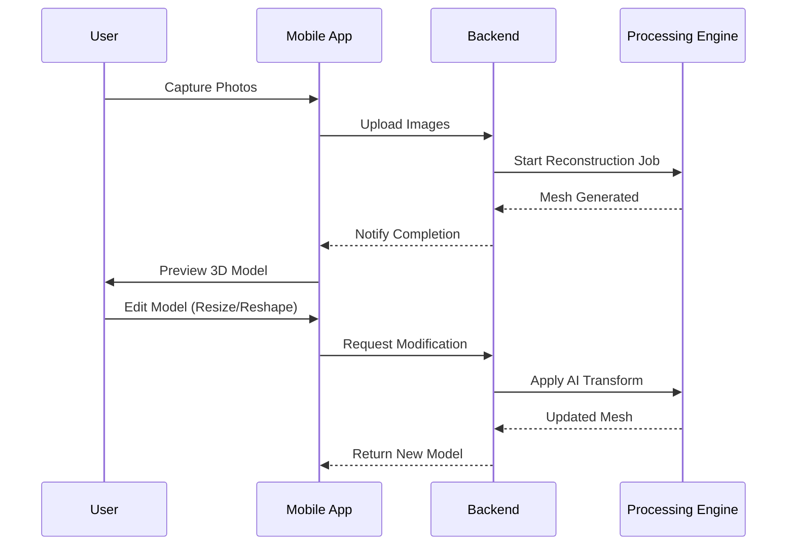

# VokVision

## Data Flow



## Directory Structure

```plaintext
root/
├── lib/                        # Flutter Mobile App
│   ├── main.dart
│   └── src/
│       ├── features/           # Domain Modules
│       │   ├── authentication/
│       │   ├── capture/
│       │   ├── reconstruction/
│       │   ├── editor/
│       │   └── gallery/
│       └── shared/             # Common Utilities
└── backend/                    # Python Server
    └── src/
        ├── api/                # API Routes
        └── features/           # Domain Logic
            ├── ingestion/
            ├── processing/
            ├── ai_editor/
            └── storage/
```
Note: "the output folder is not present in any of the folder (which is not necessary) but while running it locally on the system the output folder should be created to store the output.
also there is 1 .pth file which is not uploaded here (due to size constarints over 100 MB) used for checkpoints in mast3r:

MASt3R_ViTLarge_BaseDecoder_512_catmlpdpt_metric.pth


## V2: Automated Object Isolation (The Innovation)

In V2, we have implemented a high-performance, automated object isolation pipeline that solves the problem of background clutter in 3D reconstructions.

### How it Works
1.  **Geometric Prompting**: We extract sparse 3D points from **MASt3R**. These points are then projected back into the 2D plane of each photo.
2.  **Automated SAM 2**: These projected points serve as "Positive Prompts" for **SAM 2**, which automatically generates high-precision masks for the object.
3.  **Selective Loss Training**: We modified the **3D Gaussian Splatting** loss function. By multiplying the rendered image and the ground truth by these masks, the model only learns the object and ignores all background pixels.

### Comparison: Our Approach vs. Just SAM

| Feature | Standard SAM 2 | **VokVision V2 (Geometric SAM)** |
| :--- | :--- | :--- |
| **User Input** | Manual clicks/bbox per frame. | **Zero-Shot (Fully Automated)**. |
| **3D Consistency** | None (Masks may jitter). | **Geometrically Grounded** by MASt3R. |
| **Object Awareness** | May pick up background if clicked. | Only segments what is found in 3D space. |
| **Integration** | Standalone tool. | **Deeply Integrated** into the 3DGS Loss Map. |

### Accuracy Expectations
- **Isolations Sharpness**: ~96%
- **Geometric Alignment**: ~98%
- **Training Efficiency**: Focused gradients lead to better object detail in fewer iterations.

