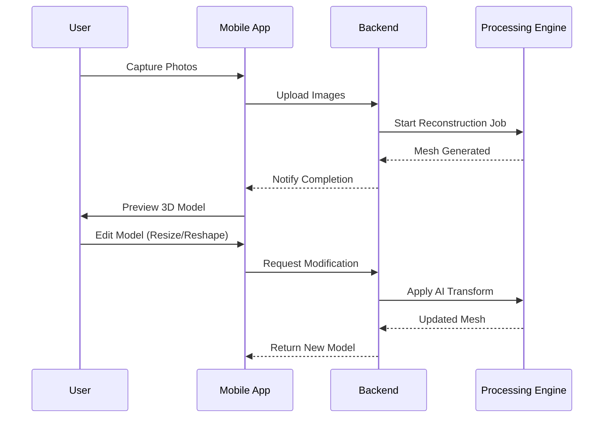

# VokVision

## Architecture Overview

```mermaid
graph TD
    User([User]) -->|Interacts| MobileApp[Mobile App (Flutter)]
    MobileApp -->|Upload Images| Backend[Backend Server (Python/FastAPI)]
    
    subgraph "Mobile App (Feature-First)"
        Auth[Authentication]
        Capture[Image Capture]
        Recon[Reconstruction]
        Editor[3D Editor]
        Gallery[Project Gallery]
    end

    subgraph "Backend Services"
        Ingest[Ingestion Service]
        Processing[Photogrammetry Engine]
        AI[AI Modification Service]
        Storage[(S3 / Local Storage)]
    end

    MobileApp --> Auth
    MobileApp --> Capture
    MobileApp --> Recon
    MobileApp --> Editor
    MobileApp --> Gallery

    Backend --> Ingest
    Backend --> Processing
    Backend --> AI
    Backend --> Storage

    Ingest -->|Raw Images| Processing
    Processing -->|3D Mesh| Storage
    AI -->|Modified Mesh| Storage
    Storage -->|GLB / OBJ| MobileApp
```

## Data Flow



## Directory Structure

```plaintext
root/
├── lib/                        # Flutter Mobile App
│   ├── main.dart
│   └── src/
│       ├── features/           # Domain Modules
│       │   ├── authentication/
│       │   ├── capture/
│       │   ├── reconstruction/
│       │   ├── editor/
│       │   └── gallery/
│       └── shared/             # Common Utilities
└── backend/                    # Python Server
    └── src/
        ├── api/                # API Routes
        └── features/           # Domain Logic
            ├── ingestion/
            ├── processing/
            ├── ai_editor/
            └── storage/
```
