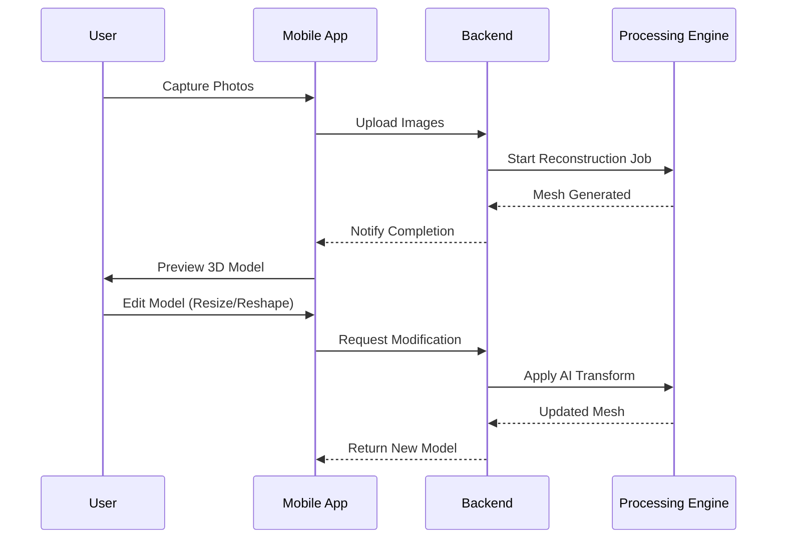

# VokVision

## Data Flow



## Directory Structure

```plaintext
root/
├── lib/                        # Flutter Mobile App
│   ├── main.dart
│   └── src/
│       ├── features/           # Domain Modules
│       │   ├── authentication/
│       │   ├── capture/
│       │   ├── reconstruction/
│       │   ├── editor/
│       │   └── gallery/
│       └── shared/             # Common Utilities
└── backend/                    # Python Server
    └── src/
        ├── api/                # API Routes
        └── features/           # Domain Logic
            ├── ingestion/
            ├── processing/
            ├── ai_editor/
            └── storage/
```
Note: "the output folder is not present in any of the folder (which is not necessary) but while running it locally on the system the output folder should be created to store the output.
also there is 1 .pth file which is not uploaded here (due to size constarints over 100 MB) used for checkpoints in mast3r:
MASt3R_ViTLarge_BaseDecoder_512_catmlpdpt_metric.pth

