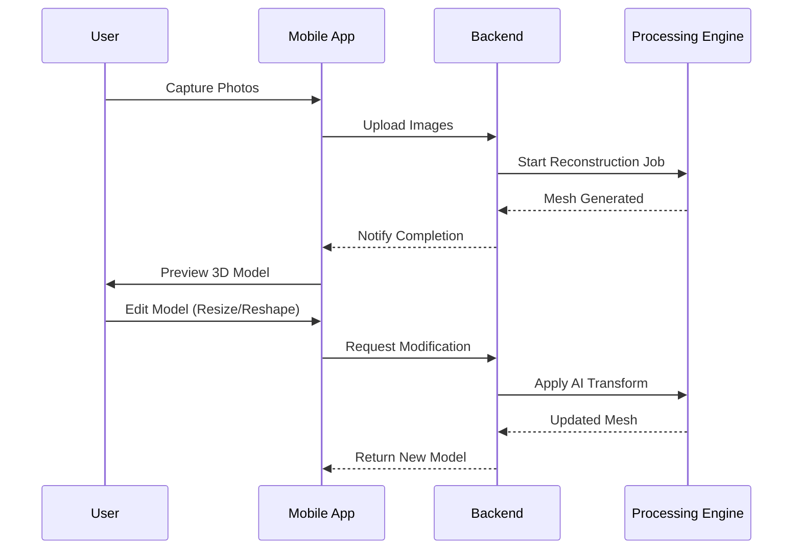

# VokVision

## Data Flow



## Directory Structure

```plaintext
root/
├── lib/                        # Flutter Mobile App
│   ├── main.dart
│   └── src/
│       ├── features/           # Domain Modules
│       │   ├── authentication/
│       │   ├── capture/
│       │   ├── reconstruction/
│       │   ├── editor/
│       │   └── gallery/
│       └── shared/             # Common Utilities
└── backend/                    # Python Server
    └── src/
        ├── api/                # API Routes
        └── features/           # Domain Logic
            ├── ingestion/
            ├── processing/
            ├── ai_editor/
            └── storage/
```
